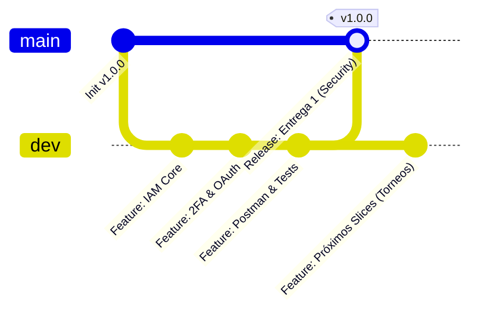

# 🏆 SportFlow - Backend de Gestión de Eventos Deportivos

Plataforma backend de alto rendimiento para la administración, organización, calendarización y analítica de torneos y eventos deportivos.

El proyecto está construido bajo una arquitectura de **Vertical Slicing (Rebanadas Verticales)**, **Domain-Driven Design (DDD)**, patrones **POO avanzados**, **principios S.I.D. (Single Responsibility, Interface Segregation, Dependency Inversion)** y cumpliendo estrictamente con el **Contrato de Gobernanza Técnica** (cero SDKs comerciales para integraciones de red).

---

## 📦 Documentación Formal: ENTREGA 1 (Módulo de Seguridad)

Toda la documentación consolidada para la sustentación y entrega de este hito se encuentra organizada en la carpeta [`entrega 1/`](file:///d:/escritorio/para%20entregar/proyecto%20universidad/back/entrega%201/):

1. **[INFORME_EJECUTIVO_ENTREGA_1.md](file:///d:/escritorio/para%20entregar/proyecto%20universidad/back/entrega%201/INFORME_EJECUTIVO_ENTREGA_1.md):** Informe técnico y ejecutivo con resumen del proyecto, principios de ingeniería y cumplimiento al 100% del Anexo 1.
2. **[1_ARQUITECTURA_Y_DISENO.md](file:///d:/escritorio/para%20entregar/proyecto%20universidad/back/entrega%201/1_ARQUITECTURA_Y_DISENO.md):** Vertical Slices, diagramas Mermaid de componentes y secuencias (2FA, OAuth2 nativo), y ADRs.
3. **[2_MODELO_BASE_DE_DATOS_Y_DDL.md](file:///d:/escritorio/para%20entregar/proyecto%20universidad/back/entrega%201/2_MODELO_BASE_DE_DATOS_Y_DDL.md):** Diagrama ER, script DDL PostgreSQL (3NF con UUIDs) y diccionario exhaustivo de datos de 10 entidades.
4. **[3_ESPECIFICACION_API_REST.md](file:///d:/escritorio/para%20entregar/proyecto%20universidad/back/entrega%201/3_ESPECIFICACION_API_REST.md):** Contratos JSON de endpoints REST v1 y matriz de códigos HTTP (`200`, `201`, `400`, `401`, `403`, `409`, `422`, `500`).
5. **[4_MATRIZ_TRAZABILIDAD_REQUISITOS.md](file:///d:/escritorio/para%20entregar/proyecto%20universidad/back/entrega%201/4_MATRIZ_TRAZABILIDAD_REQUISITOS.md):** Mapeo de `HU-SE-01` a `HU-SE-10` contra casos de uso, entidades, endpoints, componentes frontend y tests.
6. **[5_MANUAL_INSTALACION_Y_PRUEBAS.md](file:///d:/escritorio/para%20entregar/proyecto%20universidad/back/entrega%201/5_MANUAL_INSTALACION_Y_PRUEBAS.md):** Guía de instalación, variables de entorno, credenciales y pruebas paso a paso.
7. **[`postman/`](file:///d:/escritorio/para%20entregar/proyecto%20universidad/back/postman/):** Colección de Postman v2.1.0, entorno de variables y [GUIA_PRUEBAS_POSTMAN.md](file:///d:/escritorio/para%20entregar/proyecto%20universidad/back/postman/GUIA_PRUEBAS_POSTMAN.md) para pruebas de caja negra.

## 🌿 Estrategia de Ramas en el Repositorio (Git Branching Model)

El repositorio está estructurado bajo un modelo estricto de bifurcación y gobernanza de código compuesto por dos ramas principales:

| Rama | Tipo | Propósito y Reglas de Gobernanza |
| :--- | :---: | :--- |
| **`main`** | **Producción / Release** | Rama inmutable y estable que contiene las **versiones oficiales de entrega** (como la Entrega 1 - Módulo de Seguridad). Todo código en `main` está probado, auditado, documentado y listo para evaluación o despliegue productivo. No admite commits directos desordenados. |
| **`dev`** | **Desarrollo / Integración** | Rama activa de desarrollo continuo (Integration Branch). En `dev` convergen las nuevas implementaciones de negocio, vertical slices (torneos, partidos, etc.) y ajustes de ingeniería antes de ser congeladas y promovidas hacia `main`. |

### Flujo de Trabajo (Gitflow Simplificado)


---

## 🏛️ Gobernanza y Arquitectura del Sistema

El sistema implementa el **Módulo de Seguridad y Control de Acceso** (`HU-SE-01` a `HU-SE-10` del Anexo 1) organizado en rebanadas verticales autónomas:

```text
back/
├── docs/                        # Documentación técnica mandatoria
│   ├── 1_architecture.md        # Diseño de arquitectura, diagramas Mermaid y ADRs
│   ├── 2_database.md            # Script DDL PostgreSQL (3NF) y diccionario de datos
│   └── 3_api_spec.md            # Especificación exhaustiva de endpoints HTTP REST
├── src/
│   ├── main/
│   │   ├── java/com/sportflow/
│   │   │   ├── SportFlowApplication.java
│   │   │   ├── core/            # Núcleo compartido global
│   │   │   │   ├── config/      # Configuración de Seguridad Stateless, JWT y CORS
│   │   │   │   ├── errors/      # Excepciones de dominio y GlobalExceptionHandler
│   │   │   │   └── http/        # NativeHttpClient puro (Cero SDKs comerciales)
│   │   │   └── features/
│   │   │       └── security/    # Rebanada Vertical de Seguridad
│   │   │           ├── domain/          # Entidades puras, Value Objects y Puertos
│   │   │           ├── application/     # Casos de uso de negocio (S.I.D.) y DTOs
│   │   │           └── infrastructure/  # Controladores REST, JPA y Adaptadores OAuth
│   │   └── resources/
│   │       └── application.yml  # Perfiles dev (H2 en memoria) y prod (PostgreSQL)
│   └── test/                    # Suites de pruebas automatizadas (MockMvc y Unitarias)
├── pom.xml                      # Dependencias Maven (Spring Boot 3.4 / Java 21-25)
├── mvnw / mvnw.cmd              # Maven Wrapper integrado y portable
└── README.md                    # Guía técnica de despliegue
```

---

## 🚀 Requisitos del Entorno

* **Java:** JDK 21 LTS o JDK 25 LTS (detectado Java 25).
* **Gestor de Construcción:** Maven Wrapper integrado (`./mvnw` en Linux/macOS o `.\mvnw.cmd` en Windows). No requiere instalación global de Maven.
* **Base de Datos:**
  * **Modo Desarrollo (`dev`):** H2 embebido en memoria en modo compatibilidad PostgreSQL (no requiere instalar software externo).
  * **Modo Producción (`prod`):** PostgreSQL 15+ / 16.

---

## ⚙️ Inicialización y Ejecución Rápida

### 1. Ejecución de la Suite de Pruebas Automatizadas
Para validar que el dominio, los casos de uso y los endpoints funcionen al 100%:

```powershell
.\mvnw.cmd test
```

### 2. Iniciar el Servidor Local Backend
Para arrancar el backend en el puerto `8080` (con perfil `dev` activo y base de datos en memoria):

```powershell
.\mvnw.cmd spring-boot:run
```

El sistema cuenta con un `SecurityDataSeeder` automático que al inicializar crea:
- **Roles:** `ADMIN`, `ORGANIZADOR`, `DELEGADO`, `JUGADOR`, `AFICIONADO`.
- **Permisos Granulares:** Sobre los recursos `USUARIOS`, `ROLES`, `PERMISOS`, `TORNEOS`, `PARTIDOS`.
- **Usuario SuperAdmin Inicial:**
  - **Email:** `admin@sportflow.com`
  - **Contraseña:** `AdminPassword123!#`

### 3. Iniciar el Servidor Frontend (React + Tailwind CSS v3)
En una terminal secundaria, accede al directorio `frontend` y ejecuta:

```powershell
cd frontend
npm run dev
```

Abre en tu navegador `http://localhost:5173` para interactuar con:
* Inicio de sesión con credenciales y autocompletado rápido de SuperAdmin.
* Pruebas y validación interactiva de OAuth2 nativo (Google y GitHub).
* Desafío de Segundo Factor (2FA) con código OTP de 6 dígitos.
* Registro de nuevas cuentas tradicionales.
* Dashboard con inspector de token JWT (Bearer), roles RBAC y matriz de permisos.

### 4. Consola H2 para Inspección de Datos
Con el servidor en ejecución, puedes inspeccionar las tablas relacionales abriendo en tu navegador:
- **URL:** `http://localhost:8080/h2-console`
- **JDBC URL:** `jdbc:h2:mem:sportflowdb`
- **Usuario:** `sa`
- **Contraseña:** *(vacía)*

---

## 🔒 Regla de Oro: Integraciones OAuth Nativas

Para cumplir con la prohibición estricta de SDKs comerciales empaquetados, la autenticación OAuth2 de **Google** y **GitHub** se realiza mediante el cliente HTTP nativo `com.sportflow.core.http.NativeHttpClient`:
- Se consumen directamente las URLs REST de los proveedores:
  - Google: `https://www.googleapis.com/oauth2/v3/userinfo`
  - GitHub: `https://api.github.com/user` y `https://api.github.com/user/emails`
- Las cabeceras `Authorization: Bearer <token>` se inyectan en crudo.
- Las respuestas JSON se deserializan utilizando Jackson estándar.

---

## 📚 Documentación Técnica Detallada

Para consultar las especificaciones formales generadas por los agentes especialistas, revisa los documentos en la carpeta `docs/`:
1. [docs/1_architecture.md](docs/1_architecture.md): Arquitectura de software, diagramas Mermaid de componentes y secuencias, registro de decisiones (ADR).
2. [docs/2_database.md](docs/2_database.md): Script DDL completo de PostgreSQL con llaves primarias `UUID`, restricciones `NOT NULL`, integridad referencial explícita y diccionario de datos en 3NF.
3. [docs/3_api_spec.md](docs/3_api_spec.md): Catálogo de endpoints con payloads JSON reales y matrices estrictas de respuestas (`200`/`201`, `400`, `401`, `403`, `422`, `500`).
