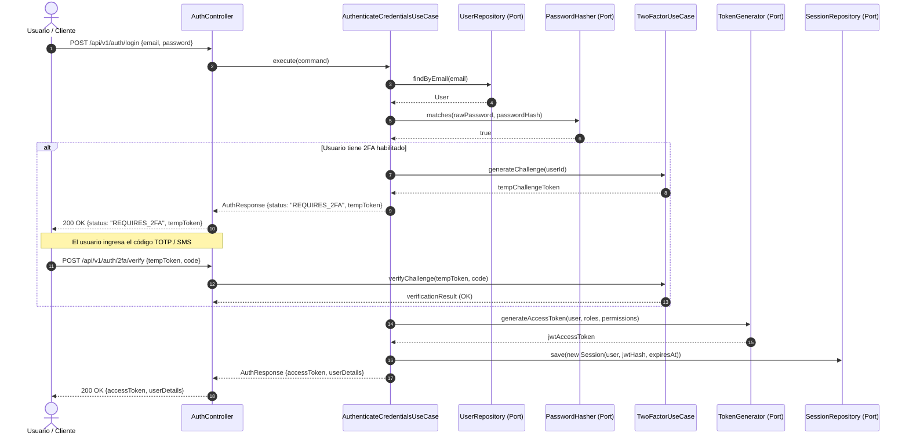
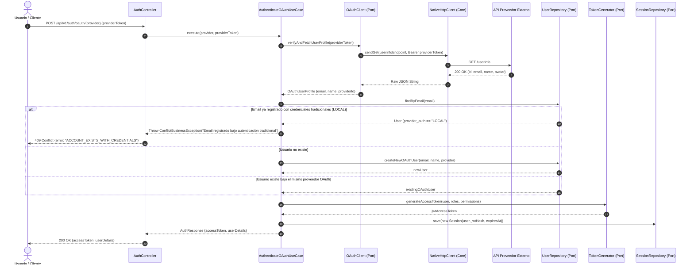

# 📐 Documento de Arquitectura de Software - Módulo de Seguridad
**Proyecto:** SportFlow - Plataforma de Gestión de Eventos Deportivos  
**Módulo:** Seguridad y Control de Acceso (Security & IAM)  
**Versión:** 1.0.0  
**Estado:** Aprobado / Vigente  
**Autor:** Agente 2 - Staff Software Architect  

---

## 1. Resumen Ejecutivo y Alcance Técnico

El presente documento formaliza el diseño arquitectónico para el **Módulo de Seguridad** del sistema SportFlow. Este componente constituye el cimiento de control de acceso, gestión de identidades y autorización para los módulos posteriores (Gestión Deportiva, Competencias, Escenarios e Inteligencia Artificial).

El diseño se fundamenta en:
1. **Vertical Slicing (Rebanadas Verticales):** Agrupación del código por capacidades de negocio autónomas (`src/features/security/`), rompiendo la arquitectura horizontal monolítica tradicional.
2. **Domain-Driven Design (DDD) & POO Avanzada:** Entidades de dominio ricas con encapsulamiento estricto de estado e invariantes de negocio (no modelos anémicos).
3. **Principios S.I.D. (Single Responsibility, Interface Segregation, Dependency Inversion):**
   - **S:** Casos de uso especializados y desacoplados.
   - **I:** Puertos e interfaces segregadas por responsabilidad operativa.
   - **D:** El dominio y la aplicación no dependen de ningún framework o biblioteca externa; la infraestructura implementa las abstracciones.
4. **Gobernanza Cero SDKs Comerciales:** Prohibición estricta de SDKs de terceros para autenticación de identidad. Las integraciones con proveedores de identidad externos (Google, GitHub) se consumen directamente sobre sus endpoints REST estándar utilizando el cliente HTTP nativo alojado en `src/core/http/`.

---

## 2. Diagrama de Componentes del Sistema

El siguiente diagrama modela la interacción entre las capas del módulo de seguridad y los elementos compartidos del núcleo (`src/core/`):

```mermaid
graph TD
    subgraph ExternalClients ["Clientes Externos"]
        WebSPA["Aplicación Web SPA"]
        MobileApp["Cliente Móvil"]
    end

    subgraph CoreLayer ["src/core (Núcleo Compartido)"]
        CoreHttp["core/http/NativeHttpClient<br/>(Cliente HTTP Nativo)"]
        CoreErrors["core/errors/GlobalExceptionHandler<br/>(Manejo Unificado de Errores)"]
        CoreConfig["core/config/SecurityConfig<br/>(Configuración Stateless & CORS)"]
    end

    subgraph FeatureSecurity ["src/features/security (Vertical Slice)"]
        subgraph InfrastructureLayer ["infrastructure (Adaptadores & Controladores)"]
            AuthController["AuthController<br/>/api/v1/auth/*"]
            UserController["UserController<br/>/api/v1/users/*"]
            RoleController["RoleController<br/>/api/v1/roles/*"]
            PermissionController["PermissionController<br/>/api/v1/permissions/*"]
            JwtFilter["JwtAuthenticationFilter"]
            
            JpaUserRepo["JpaUserRepositoryAdapter"]
            JpaRoleRepo["JpaRoleRepositoryAdapter"]
            JpaPermRepo["JpaPermissionRepositoryAdapter"]
            JpaSessionRepo["JpaSessionRepositoryAdapter"]
            
            BCryptAdapter["BCryptPasswordEncoderAdapter"]
            JwtAdapter["JwtTokenServiceAdapter"]
            GoogleOAuth["NativeGoogleOAuthAdapter"]
            GitHubOAuth["NativeGitHubOAuthAdapter"]
        end

        subgraph ApplicationLayer ["application (Casos de Uso - S.I.D.)"]
            RegisterUser["RegisterUserUseCase"]
            Authenticate["AuthenticateCredentialsUseCase"]
            AuthenticateOAuth["AuthenticateOAuthUseCase"]
            Manage2FA["TwoFactorUseCase"]
            PasswordReset["PasswordResetUseCase"]
            ManageUsers["ManageUsersUseCase"]
            ManageRoles["ManageRolesUseCase"]
            AssignPermissions["AssignPermissionsUseCase"]
        end

        subgraph DomainLayer ["domain (Entidades Puras & Puertos)"]
            User["User (Entity / Root)"]
            Person["Person (Entity)"]
            Role["Role (Entity)"]
            Permission["Permission (Entity)"]
            Session["UserSession (Entity)"]
            
            UserRepoPort["UserRepository (Port)"]
            RoleRepoPort["RoleRepository (Port)"]
            PermRepoPort["PermissionRepository (Port)"]
            SessionRepoPort["SessionRepository (Port)"]
            
            PasswordHasherPort["PasswordHasher (Port)"]
            TokenGeneratorPort["TokenGenerator (Port)"]
            OAuthClientPort["OAuthClient (Port)"]
        end
    end

    subgraph ExternalProviders ["Proveedores de Identidad (REST Crudo)"]
        GoogleApi["Google OAuth2 API (userinfo)"]
        GitHubApi["GitHub API (user/emails)"]
    end

    WebSPA -->|HTTPS / JSON| AuthController
    WebSPA -->|HTTPS / JSON| UserController
    WebSPA -->|HTTPS / JSON| RoleController
    WebSPA -->|HTTPS / JSON| PermissionController
    MobileApp -->|HTTPS / JSON| AuthController

    AuthController --> RegisterUser
    AuthController --> Authenticate
    AuthController --> AuthenticateOAuth
    AuthController --> Manage2FA
    AuthController --> PasswordReset
    
    UserController --> ManageUsers
    RoleController --> ManageRoles
    RoleController --> AssignPermissions
    PermissionController --> AssignPermissions

    RegisterUser --> UserRepoPort
    RegisterUser --> PasswordHasherPort
    Authenticate --> UserRepoPort
    Authenticate --> PasswordHasherPort
    Authenticate --> TokenGeneratorPort
    Authenticate --> SessionRepoPort
    AuthenticateOAuth --> OAuthClientPort
    AuthenticateOAuth --> UserRepoPort
    AuthenticateOAuth --> TokenGeneratorPort

    JpaUserRepo -.->|Implementa| UserRepoPort
    JpaRoleRepo -.->|Implementa| RoleRepoPort
    JpaPermRepo -.->|Implementa| PermRepoPort
    JpaSessionRepo -.->|Implementa| SessionRepoPort
    BCryptAdapter -.->|Implementa| PasswordHasherPort
    JwtAdapter -.->|Implementa| TokenGeneratorPort
    GoogleOAuth -.->|Implementa| OAuthClientPort
    GitHubOAuth -.->|Implementa| OAuthClientPort

    GoogleOAuth --> CoreHttp
    GitHubOAuth --> CoreHttp
    CoreHttp -->|HTTP GET/POST Nativo| GoogleApi
    CoreHttp -->|HTTP GET/POST Nativo| GitHubApi
    JwtFilter --> JwtAdapter
```

---

## 3. Diagramas de Secuencia de Procesos Clave

### 3.1. Flujo de Autenticación con Credenciales Tradicionales y 2FA (HU-SE-08 / HU-SE-10)

### 3.2. Flujo de Autenticación OAuth2 Nativa (Google / GitHub) (HU-SE-08)

---

## 4. Registro de Decisiones de Arquitectura (ADR)

### ADR 01: Adopción de Vertical Slicing en lugar de Capas Horizontales Monolíticas
* **Contexto:** La arquitectura tradicional de capas horizontales (`controllers/`, `services/`, `repositories/`) genera acoplamiento disperso, dificulta la independencia de despliegue y confunde los límites de dominio.
* **Decisión:** Implementar Vertical Slicing agrupando cada dominio en `src/features/[nombre_modulo]/` conteniendo sus subdirectorios `domain`, `application` e `infrastructure`.
* **Consecuencias:** Alta cohesión y bajo acoplamiento. Si una funcionalidad se modifica o elimina, no se dispersa el impacto por todo el repositorio.

### ADR 02: Gobernanza Cero SDKs Comerciales para Autenticación e Integraciones
* **Contexto:** La importación de SDKs empaquetados de terceros (Firebase, Supabase, Stripe SDK, Google Auth Client) introduce dependencias pesadas, incompatibilidades de runtime (Java 25), fugas de abstracción y vulnerabilidades de seguridad en la cadena de suministro.
* **Decisión:** Prohibición estricta de SDKs empaquetados. Todas las integraciones con servicios externos se consumen mediante llamadas HTTP nativas puras (`java.net.http.HttpClient` encapsulated en `src/core/http/NativeHttpClient`), parseando manualmente las solicitudes y respuestas JSON con Jackson estándar.
* **Consecuencias:** Control milimétrico de cabeceras, tiempos de espera (timeouts), telemetría, seguridad de red y total independencia tecnológica.

### ADR 03: Modelo de Persistencia Relacional Normalizado (PostgreSQL 3NF) con UUIDs
* **Contexto:** El modelo de seguridad debe soportar concurrencia masiva, auditoría inmutable, asignación dinámica M:N de roles/permisos y prevención de enumeración secuencial de usuarios.
* **Decisión:** Utilizar PostgreSQL con identificadores universales únicos (`UUID` v4) para todas las entidades físicas. Aplicar Tercera Forma Normal (3NF) y nomenclatura `snake_case` en plural.
* **Consecuencias:** Prevención de ataques IDOR (Insecure Direct Object References), distribución segura en réplicas de lectura y consistencia ACID absoluta.

### ADR 04: Separación Estricta de Persona, Cuenta de Usuario y Perfil
* **Contexto:** En el dominio deportivo, una misma `Persona` biográfica (ej. deportista o aficionado) puede tener múltiples roles en el tiempo o no disponer inicialmente de acceso al sistema (ej. menor de edad registrado por un tutor). A su vez, los datos de acceso (`Usuario`) no deben contaminarse con datos multimedia (`Perfil`).
* **Decisión:** Modelar tres entidades separadas: `Persona` (datos civiles/identificación), `Usuario` (credenciales, 2FA, estado, proveedor de autenticación) y `Perfil` (foto, teléfono, preferencias), vinculadas mediante llaves foráneas estrictas con restricciones de unicidad.
* **Consecuencias:** Máxima flexibilidad para el posterior crecimiento de los módulos deportivos (Anexos 2, 3, 4 y 5).

### ADR 05: Estrategia de Ramas y Control de Versiones (Git Branching Model: main, dev, e01, e02)
* **Contexto:** El ciclo de vida del software universitario y empresarial requiere separar el código en evolución activa del código certificado y auditado para entrega oficial y producción.
* **Decisión:** Adoptar un modelo estructurado con las siguientes ramas:
  1. **`main` (Production / Release):** Rama protegida e inmutable que alberga exclusivamente versiones estables, probadas al 100% y aprobadas para evaluación formal o despliegue.
  2. **`dev` (Development / Integration):** Rama activa donde converge el desarrollo continuo y la integración de las características.
  3. **`e01` (Primera Entrega):** Rama fija y certificada que preserva el código inalterable de la **Entrega 1: Módulo de Seguridad y Control de Acceso (HU-SE-01 a HU-SE-10)**.
  4. **`e02` (Segunda Entrega):** Rama de trabajo dedicada a la construcción de la **Entrega 2 (Módulos Deportivos)** a partir de la línea base validada.
* **Consecuencias:** Trazabilidad absoluta para los evaluadores universitarios, prevención de regresiones en entregas previas y aislamiento ordenado del trabajo en curso.

