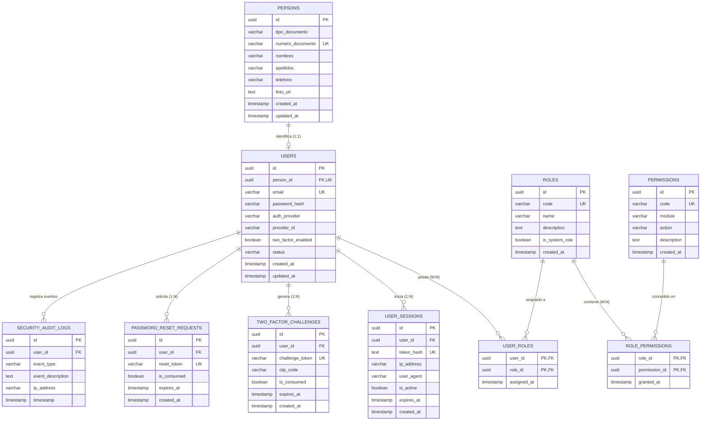

# 🗄️ Modelo de Base de Datos y Script DDL (Entrega 1)
**Motor de Persistencia:** PostgreSQL 16+ (Compatible con H2 en modo PostgreSQL)  
**Normalización:** Tercera Forma Normal (3NF)  
**Convenciones de Nomenclatura:** `snake_case`, tablas en plural, llaves foráneas con sufijo `_id`  
**Autor:** Agente 3 - Principal Database Administrator (DBA)  
**Versión:** 1.0.0  

---

## 1. Diagrama Entidad-Relación (Mermaid ER)



---

## 2. Script DDL SQL Inmaculado (PostgreSQL)

```sql
-- ============================================================================
-- SPORTFLOW - SISTEMA DE GESTIÓN DE EVENTOS DEPORTIVOS
-- DDL DEL MÓDULO DE SEGURIDAD Y CONTROL DE ACCESO (IAM)
-- Cumplimiento estricto: PostgreSQL 3NF, UUIDs, Integridad Referencial
-- ============================================================================

-- Habilitar extensión para generación de identificadores únicos universales
CREATE EXTENSION IF NOT EXISTS "uuid-ossp";

-- ----------------------------------------------------------------------------
-- 1. TABLA: persons (Identidad natural y legal del individuo)
-- ----------------------------------------------------------------------------
CREATE TABLE persons (
    id UUID PRIMARY KEY DEFAULT uuid_generate_v4(),
    tipo_documento VARCHAR(20) NOT NULL,
    numero_documento VARCHAR(50) NOT NULL,
    nombres VARCHAR(100) NOT NULL,
    apellidos VARCHAR(100) NOT NULL,
    telefono VARCHAR(25) NULL,
    foto_url TEXT NULL,
    created_at TIMESTAMP WITH TIME ZONE NOT NULL DEFAULT CURRENT_TIMESTAMP,
    updated_at TIMESTAMP WITH TIME ZONE NOT NULL DEFAULT CURRENT_TIMESTAMP,
    CONSTRAINT uq_persons_documento UNIQUE (tipo_documento, numero_documento)
);

CREATE INDEX idx_persons_documento ON persons(numero_documento);

-- ----------------------------------------------------------------------------
-- 2. TABLA: users (Cuentas de acceso tecnológico)
-- ----------------------------------------------------------------------------
CREATE TABLE users (
    id UUID PRIMARY KEY DEFAULT uuid_generate_v4(),
    person_id UUID NOT NULL,
    email VARCHAR(255) NOT NULL,
    password_hash VARCHAR(255) NULL,
    auth_provider VARCHAR(30) NOT NULL DEFAULT 'LOCAL',
    provider_id VARCHAR(150) NULL,
    two_factor_enabled BOOLEAN NOT NULL DEFAULT FALSE,
    status VARCHAR(30) NOT NULL DEFAULT 'ACTIVE',
    created_at TIMESTAMP WITH TIME ZONE NOT NULL DEFAULT CURRENT_TIMESTAMP,
    updated_at TIMESTAMP WITH TIME ZONE NOT NULL DEFAULT CURRENT_TIMESTAMP,
    CONSTRAINT uq_users_email UNIQUE (email),
    CONSTRAINT uq_users_person UNIQUE (person_id),
    CONSTRAINT fk_users_person FOREIGN KEY (person_id) 
        REFERENCES persons(id) ON DELETE RESTRICT ON UPDATE CASCADE,
    CONSTRAINT chk_users_auth_provider CHECK (auth_provider IN ('LOCAL', 'GOOGLE', 'GITHUB', 'MICROSOFT')),
    CONSTRAINT chk_users_status CHECK (status IN ('ACTIVE', 'INACTIVE', 'SUSPENDED', 'BLOCKED'))
);

CREATE INDEX idx_users_email ON users(email);
CREATE INDEX idx_users_provider ON users(auth_provider, provider_id);

-- ----------------------------------------------------------------------------
-- 3. TABLA: roles (Catálogo de niveles de acceso y autorización RBAC)
-- ----------------------------------------------------------------------------
CREATE TABLE roles (
    id UUID PRIMARY KEY DEFAULT uuid_generate_v4(),
    code VARCHAR(50) NOT NULL,
    name VARCHAR(100) NOT NULL,
    description TEXT NULL,
    is_system_role BOOLEAN NOT NULL DEFAULT FALSE,
    created_at TIMESTAMP WITH TIME ZONE NOT NULL DEFAULT CURRENT_TIMESTAMP,
    CONSTRAINT uq_roles_code UNIQUE (code)
);

-- ----------------------------------------------------------------------------
-- 4. TABLA: permissions (Capacidades y acciones atómicas del sistema)
-- ----------------------------------------------------------------------------
CREATE TABLE permissions (
    id UUID PRIMARY KEY DEFAULT uuid_generate_v4(),
    code VARCHAR(100) NOT NULL,
    module VARCHAR(50) NOT NULL,
    action VARCHAR(50) NOT NULL,
    description TEXT NULL,
    created_at TIMESTAMP WITH TIME ZONE NOT NULL DEFAULT CURRENT_TIMESTAMP,
    CONSTRAINT uq_permissions_code UNIQUE (code)
);

CREATE INDEX idx_permissions_module ON permissions(module);

-- ----------------------------------------------------------------------------
-- 5. TABLA: user_roles (Relación M:N entre usuarios y roles)
-- ----------------------------------------------------------------------------
CREATE TABLE user_roles (
    user_id UUID NOT NULL,
    role_id UUID NOT NULL,
    assigned_at TIMESTAMP WITH TIME ZONE NOT NULL DEFAULT CURRENT_TIMESTAMP,
    PRIMARY KEY (user_id, role_id),
    CONSTRAINT fk_user_roles_user FOREIGN KEY (user_id) 
        REFERENCES users(id) ON DELETE CASCADE ON UPDATE CASCADE,
    CONSTRAINT fk_user_roles_role FOREIGN KEY (role_id) 
        REFERENCES roles(id) ON DELETE RESTRICT ON UPDATE CASCADE
);

-- ----------------------------------------------------------------------------
-- 6. TABLA: role_permissions (Relación M:N entre roles y permisos)
-- ----------------------------------------------------------------------------
CREATE TABLE role_permissions (
    role_id UUID NOT NULL,
    permission_id UUID NOT NULL,
    granted_at TIMESTAMP WITH TIME ZONE NOT NULL DEFAULT CURRENT_TIMESTAMP,
    PRIMARY KEY (role_id, permission_id),
    CONSTRAINT fk_role_permissions_role FOREIGN KEY (role_id) 
        REFERENCES roles(id) ON DELETE CASCADE ON UPDATE CASCADE,
    CONSTRAINT fk_role_permissions_permission FOREIGN KEY (permission_id) 
        REFERENCES permissions(id) ON DELETE CASCADE ON UPDATE CASCADE
);

-- ----------------------------------------------------------------------------
-- 7. TABLA: user_sessions (Control y auditoría de sesiones activas)
-- ----------------------------------------------------------------------------
CREATE TABLE user_sessions (
    id UUID PRIMARY KEY DEFAULT uuid_generate_v4(),
    user_id UUID NOT NULL,
    token_hash VARCHAR(255) NOT NULL,
    ip_address VARCHAR(45) NULL,
    user_agent TEXT NULL,
    is_active BOOLEAN NOT NULL DEFAULT TRUE,
    expires_at TIMESTAMP WITH TIME ZONE NOT NULL,
    created_at TIMESTAMP WITH TIME ZONE NOT NULL DEFAULT CURRENT_TIMESTAMP,
    CONSTRAINT uq_user_sessions_token UNIQUE (token_hash),
    CONSTRAINT fk_user_sessions_user FOREIGN KEY (user_id) 
        REFERENCES users(id) ON DELETE CASCADE ON UPDATE CASCADE
);

CREATE INDEX idx_user_sessions_user_active ON user_sessions(user_id, is_active);

-- ----------------------------------------------------------------------------
-- 8. TABLA: two_factor_challenges (Desafíos temporales OTP de segundo factor)
-- ----------------------------------------------------------------------------
CREATE TABLE two_factor_challenges (
    id UUID PRIMARY KEY DEFAULT uuid_generate_v4(),
    user_id UUID NOT NULL,
    challenge_token VARCHAR(255) NOT NULL,
    otp_code VARCHAR(10) NOT NULL,
    is_consumed BOOLEAN NOT NULL DEFAULT FALSE,
    expires_at TIMESTAMP WITH TIME ZONE NOT NULL,
    created_at TIMESTAMP WITH TIME ZONE NOT NULL DEFAULT CURRENT_TIMESTAMP,
    CONSTRAINT uq_two_factor_token UNIQUE (challenge_token),
    CONSTRAINT fk_two_factor_user FOREIGN KEY (user_id) 
        REFERENCES users(id) ON DELETE CASCADE ON UPDATE CASCADE
);

CREATE INDEX idx_two_factor_token ON two_factor_challenges(challenge_token);

-- ----------------------------------------------------------------------------
-- 9. TABLA: password_reset_requests (Tokens seguros para restablecimiento)
-- ----------------------------------------------------------------------------
CREATE TABLE password_reset_requests (
    id UUID PRIMARY KEY DEFAULT uuid_generate_v4(),
    user_id UUID NOT NULL,
    reset_token VARCHAR(255) NOT NULL,
    is_consumed BOOLEAN NOT NULL DEFAULT FALSE,
    expires_at TIMESTAMP WITH TIME ZONE NOT NULL,
    created_at TIMESTAMP WITH TIME ZONE NOT NULL DEFAULT CURRENT_TIMESTAMP,
    CONSTRAINT uq_password_reset_token UNIQUE (reset_token),
    CONSTRAINT fk_password_reset_user FOREIGN KEY (user_id) 
        REFERENCES users(id) ON DELETE CASCADE ON UPDATE CASCADE
);

CREATE INDEX idx_password_reset_token ON password_reset_requests(reset_token);

-- ----------------------------------------------------------------------------
-- 10. TABLA: security_audit_logs (Trazabilidad inmutable de eventos de seguridad)
-- ----------------------------------------------------------------------------
CREATE TABLE security_audit_logs (
    id UUID PRIMARY KEY DEFAULT uuid_generate_v4(),
    user_id UUID NULL,
    event_type VARCHAR(60) NOT NULL,
    event_description TEXT NOT NULL,
    ip_address VARCHAR(45) NULL,
    timestamp TIMESTAMP WITH TIME ZONE NOT NULL DEFAULT CURRENT_TIMESTAMP,
    CONSTRAINT fk_security_audit_user FOREIGN KEY (user_id) 
        REFERENCES users(id) ON DELETE SET NULL ON UPDATE CASCADE
);

CREATE INDEX idx_audit_event_timestamp ON security_audit_logs(event_type, timestamp DESC);
```

---

## 3. Diccionario de Datos Exhaustivo

### 3.1. Entidad: `persons`
| Columna | Tipo de Dato | Restricciones | Descripción / Regla de Negocio |
| :--- | :--- | :--- | :--- |
| `id` | `UUID` | `PK, NOT NULL` | Identificador único universal e inmutable de la persona. |
| `tipo_documento` | `VARCHAR(20)` | `NOT NULL` | Tipo de documento de identidad legal (`CC`, `CE`, `TI`, `PASSPORT`). |
| `numero_documento` | `VARCHAR(50)` | `NOT NULL` | Número único de identificación ciudadana. |
| `nombres` | `VARCHAR(100)` | `NOT NULL` | Nombres de pila de la persona. |
| `apellidos` | `VARCHAR(100)` | `NOT NULL` | Apellidos familiares de la persona. |
| `telefono` | `VARCHAR(25)` | `NULL` | Número telefónico de contacto directo. |
| `foto_url` | `TEXT` | `NULL` | Enlace a la fotografía de perfil del individuo. |
| `created_at` | `TIMESTAMP WITH TZ` | `NOT NULL` | Fecha y hora exacta de creación del registro. |
| `updated_at` | `TIMESTAMP WITH TZ` | `NOT NULL` | Fecha y hora de la última actualización física. |

### 3.2. Entidad: `users`
| Columna | Tipo de Dato | Restricciones | Descripción / Regla de Negocio |
| :--- | :--- | :--- | :--- |
| `id` | `UUID` | `PK, NOT NULL` | Identificador único de la cuenta de usuario. |
| `person_id` | `UUID` | `FK, UK, NOT NULL` | Referencia 1:1 a la persona asociada. `ON DELETE RESTRICT`. |
| `email` | `VARCHAR(255)` | `UK, NOT NULL` | Correo electrónico institucional o personal (debe ser único en el sistema). |
| `password_hash` | `VARCHAR(255)` | `NULL` | Hash BCrypt (costo 10). Requerido para usuarios locales; nulo para OAuth. |
| `auth_provider` | `VARCHAR(30)` | `NOT NULL` | Origen de la identidad: `LOCAL`, `GOOGLE`, `GITHUB`. |
| `provider_id` | `VARCHAR(150)` | `NULL` | Identificador externo del usuario en el proveedor federado. |
| `two_factor_enabled`| `BOOLEAN` | `NOT NULL` | Indicador de si la cuenta exige desafío OTP 2FA al iniciar sesión. |
| `status` | `VARCHAR(30)` | `NOT NULL` | Estado operativo: `ACTIVE`, `INACTIVE`, `SUSPENDED`, `BLOCKED`. |
| `created_at` | `TIMESTAMP WITH TZ` | `NOT NULL` | Fecha de creación del registro. |
| `updated_at` | `TIMESTAMP WITH TZ` | `NOT NULL` | Fecha de última modificación. |

### 3.3. Entidad: `roles`
| Columna | Tipo de Dato | Restricciones | Descripción / Regla de Negocio |
| :--- | :--- | :--- | :--- |
| `id` | `UUID` | `PK, NOT NULL` | Identificador inmutable del rol. |
| `code` | `VARCHAR(50)` | `UK, NOT NULL` | Código único en mayúsculas (ej. `ADMIN`, `ATHLETE`, `REFEREE`). |
| `name` | `VARCHAR(100)` | `NOT NULL` | Nombre descriptivo del rol visible en la interfaz. |
| `description` | `TEXT` | `NULL` | Alcance y responsabilidades que confiere el rol. |
| `is_system_role` | `BOOLEAN` | `NOT NULL` | Si es `true`, es un rol protegido del sistema y no puede eliminarse. |
| `created_at` | `TIMESTAMP WITH TZ` | `NOT NULL` | Momento de creación. |

### 3.4. Entidad: `permissions`
| Columna | Tipo de Dato | Restricciones | Descripción / Regla de Negocio |
| :--- | :--- | :--- | :--- |
| `id` | `UUID` | `PK, NOT NULL` | Identificador inmutable del permiso. |
| `code` | `VARCHAR(100)` | `UK, NOT NULL` | Código canónico en formato `MODULO:ACCION` (ej. `TORNEOS:CREAR`). |
| `module` | `VARCHAR(50)` | `NOT NULL` | Nombre del módulo funcional al que pertenece el permiso. |
| `action` | `VARCHAR(50)` | `NOT NULL` | Acción autorizada (`VER`, `CREAR`, `ACTUALIZAR`, `ELIMINAR`). |
| `description` | `TEXT` | `NULL` | Explicación detallada de la potestad conferida. |
| `created_at` | `TIMESTAMP WITH TZ` | `NOT NULL` | Fecha de creación en el catálogo. |

### 3.5. Entidad: `user_roles`
| Columna | Tipo de Dato | Restricciones | Descripción / Regla de Negocio |
| :--- | :--- | :--- | :--- |
| `user_id` | `UUID` | `PK, FK, NOT NULL` | Llave foránea hacia `users.id`. `ON DELETE CASCADE`. |
| `role_id` | `UUID` | `PK, FK, NOT NULL` | Llave foránea hacia `roles.id`. `ON DELETE RESTRICT`. |
| `assigned_at` | `TIMESTAMP WITH TZ` | `NOT NULL` | Fecha y hora de vinculación del rol. |

### 3.6. Entidad: `role_permissions`
| Columna | Tipo de Dato | Restricciones | Descripción / Regla de Negocio |
| :--- | :--- | :--- | :--- |
| `role_id` | `UUID` | `PK, FK, NOT NULL` | Llave foránea hacia `roles.id`. `ON DELETE CASCADE`. |
| `permission_id` | `UUID` | `PK, FK, NOT NULL` | Llave foránea hacia `permissions.id`. `ON DELETE CASCADE`. |
| `granted_at` | `TIMESTAMP WITH TZ` | `NOT NULL` | Fecha y hora en que se otorgó el permiso al rol. |

### 3.7. Entidad: `user_sessions`
| Columna | Tipo de Dato | Restricciones | Descripción / Regla de Negocio |
| :--- | :--- | :--- | :--- |
| `id` | `UUID` | `PK, NOT NULL` | Identificador único de la sesión. |
| `user_id` | `UUID` | `FK, NOT NULL` | Usuario dueño de la sesión. `ON DELETE CASCADE`. |
| `token_hash` | `VARCHAR(255)` | `UK, NOT NULL` | Hash o identificador único del token JWT emitido. |
| `ip_address` | `VARCHAR(45)` | `NULL` | Dirección IP de origen del cliente (soporte IPv4 e IPv6). |
| `user_agent` | `TEXT` | `NULL` | Cadena User-Agent del navegador o cliente móvil. |
| `is_active` | `BOOLEAN` | `NOT NULL` | `true` si la sesión es válida; `false` si fue revocada o cerrada. |
| `expires_at` | `TIMESTAMP WITH TZ` | `NOT NULL` | Fecha y hora exacta de vencimiento del token. |
| `created_at` | `TIMESTAMP WITH TZ` | `NOT NULL` | Momento de autenticación. |

### 3.8. Entidad: `two_factor_challenges`
| Columna | Tipo de Dato | Restricciones | Descripción / Regla de Negocio |
| :--- | :--- | :--- | :--- |
| `id` | `UUID` | `PK, NOT NULL` | Identificador del desafío 2FA. |
| `user_id` | `UUID` | `FK, NOT NULL` | Usuario que intenta acceder. `ON DELETE CASCADE`. |
| `challenge_token` | `VARCHAR(255)` | `UK, NOT NULL` | Token UUID público para referenciar el desafío desde el frontend. |
| `otp_code` | `VARCHAR(10)` | `NOT NULL` | Código numérico de 6 dígitos generado para validación. |
| `is_consumed` | `BOOLEAN` | `NOT NULL` | Indicador de uso (previene ataques de repetición). |
| `expires_at` | `TIMESTAMP WITH TZ` | `NOT NULL` | Expiración estricta (5 minutos de validez). |
| `created_at` | `TIMESTAMP WITH TZ` | `NOT NULL` | Momento de generación del desafío. |

### 3.9. Entidad: `password_reset_requests`
| Columna | Tipo de Dato | Restricciones | Descripción / Regla de Negocio |
| :--- | :--- | :--- | :--- |
| `id` | `UUID` | `PK, NOT NULL` | Identificador de la solicitud de restablecimiento. |
| `user_id` | `UUID` | `FK, NOT NULL` | Usuario que solicitó la recuperación. `ON DELETE CASCADE`. |
| `reset_token` | `VARCHAR(255)` | `UK, NOT NULL` | Token criptográfico temporal enviado al usuario. |
| `is_consumed` | `BOOLEAN` | `NOT NULL` | Si es `true`, ya fue utilizado para cambiar la clave y queda invalidado. |
| `expires_at` | `TIMESTAMP WITH TZ` | `NOT NULL` | Periodo limitado de validez (15 minutos). |
| `created_at` | `TIMESTAMP WITH TZ` | `NOT NULL` | Momento de solicitud. |

### 3.10. Entidad: `security_audit_logs`
| Columna | Tipo de Dato | Restricciones | Descripción / Regla de Negocio |
| :--- | :--- | :--- | :--- |
| `id` | `UUID` | `PK, NOT NULL` | Identificador del evento de auditoría. |
| `user_id` | `UUID` | `FK, NULL` | Usuario involucrado (o `NULL` si el evento fue anónimo/fallido). |
| `event_type` | `VARCHAR(60)` | `NOT NULL` | Tipo de evento (`LOGIN_SUCCESS`, `LOGIN_FAILED`, `2FA_VERIFIED`, etc.). |
| `event_description` | `TEXT` | `NOT NULL` | Detalle contextual del suceso. |
| `ip_address` | `VARCHAR(45)` | `NULL` | Dirección IP de origen. |
| `timestamp` | `TIMESTAMP WITH TZ` | `NOT NULL` | Marca temporal inmutable del evento. |
