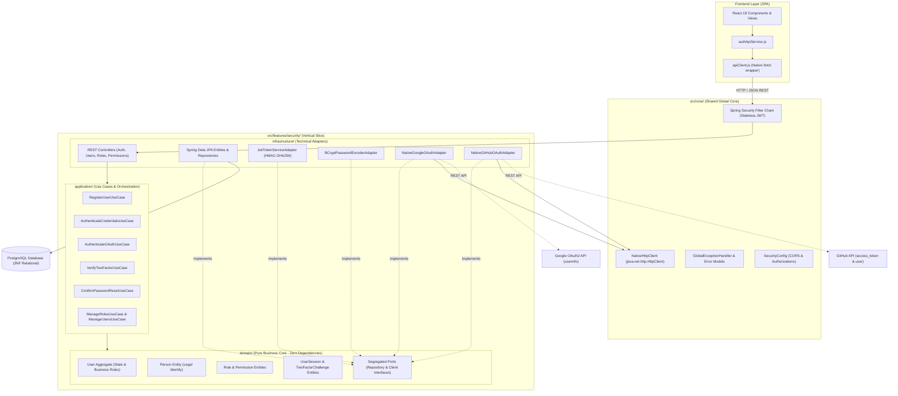
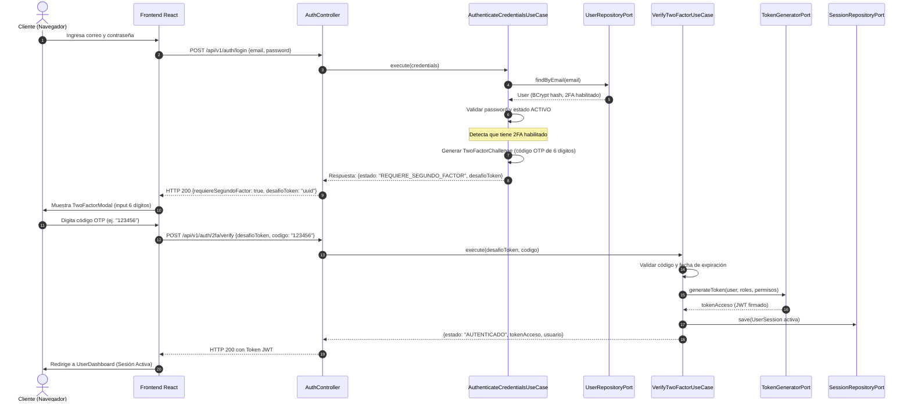
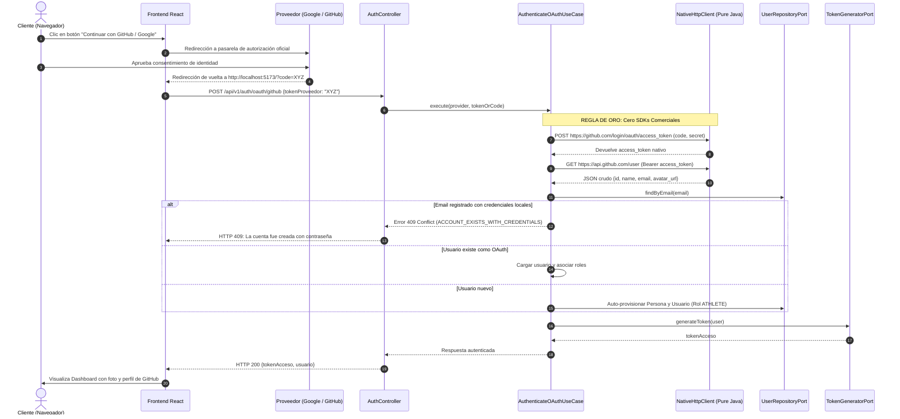

# 📐 Documento de Arquitectura y Diseño de Software (Entrega 1)
**Proyecto:** SportFlow - Plataforma de Gestión de Eventos Deportivos  
**Módulo:** Seguridad y Control de Acceso (Vertical Slice: `src/features/security/`)  
**Autor:** Agente 2 - Staff Software Architect  
**Versión:** 1.0.0  

---

## 1. Resumen Ejecutivo del Diseño

El diseño de software del **Módulo de Seguridad** de SportFlow ha sido concebido bajo los más rigurosos estándares de la ingeniería de software contemporánea: alta cohesión, bajo acoplamiento y aislamiento funcional absoluto.

En lugar de organizar el código por capas técnicas horizontales que atraviesan todo el sistema (como ocurre en los esquemas tradicionales "MVC" o "N-Tier"), SportFlow implementa **Vertical Slicing** orientado al dominio:
- Cada funcionalidad o módulo de negocio es una "rebanada vertical" autosuficiente.
- Toda la lógica de seguridad (`src/features/security/`) encapsula su propio dominio, casos de uso de aplicación e infraestructura tecnológica (adaptadores JPA, controladores REST, adaptadores de red).
- Si en el futuro se incorpora el Módulo de Gestión Deportiva (`src/features/sports/`) o el Módulo de Competencias (`src/features/tournaments/`), el sistema compilará y funcionará sin acoplarse directamente a la implementación física interna de la seguridad.

---

## 2. Diagrama de Componentes de la Arquitectura (Mermaid)

El siguiente diagrama ilustra cómo interactúa el cliente web SPA con el núcleo del sistema y la rebanada vertical de seguridad:

---

## 3. Diagramas de Secuencia de Flujos Críticos

### 3.1. Flujo de Autenticación Tradicional con Desafío 2FA (HU-SE-08 & HU-SE-10)

---

### 3.2. Flujo de Autenticación Federada OAuth2 Nativa (Google / GitHub)

---

## 4. Registro de Decisiones de Arquitectura (ADRs)

### ADR-01: Adopción de Vertical Slicing en lugar de Capas Horizontales
* **Estado:** Aceptado e Implementado.
* **Contexto:** Las arquitecturas por capas horizontales tradicionales (`com.sportflow.controllers`, `com.sportflow.services`, `com.sportflow.repositories`) acumulan deuda técnica severa al mezclar entidades de seguridad, torneos y finanzas en los mismos paquetes.
* **Decisión:** Agrupar el código por Rebanadas Verticales de Dominio (`src/features/security/`). Cada rebanada tiene su propio dominio, aplicación e infraestructura.
* **Consecuencias:** 
  - *Positivas:* Máxima cohesión, modularidad real, facilidad para extraer microservicios o migrar módulos sin efectos colaterales.
  - *Negativas:* Requiere disciplina estricta para no crear dependencias cruzadas indebidas entre features.

### ADR-02: Prohibición de SDKs Comerciales y Adopción de Cliente HTTP Nativo
* **Estado:** Aceptado e Implementado (Regla Inviolable).
* **Contexto:** Las bibliotecas de terceros comerciales empaquetan dependencias transitivas pesadas, licencias restrictivas y riesgo de desactualización (vendor lock-in).
* **Decisión:** Implementar [`NativeHttpClient.java`](file:///d:/escritorio/para%20entregar/proyecto%20universidad/back/src/main/java/com/sportflow/core/http/NativeHttpClient.java) utilizando exclusivamente la biblioteca estándar `java.net.http.HttpClient` para interactuar con las APIs REST de Google y GitHub.
* **Consecuencias:**
  - *Positivas:* Cero vendor lock-in, mínimo peso del JAR, control total sobre cabeceras, timeouts y reintentos HTTP.
  - *Negativas:* Requiere escribir manualmente el mapeo de JSON con `Jackson` para las llamadas de red externas.

### ADR-03: Utilización de Identificadores Universales Únicos (UUID v4)
* **Estado:** Aceptado e Implementado.
* **Contexto:** Los identificadores numéricos autoincrementales (`Long SERIAL`) son predecibles, exponen métricas de negocio a atacantes en endpoints REST y complican la replicación distribuida.
* **Decisión:** Todas las llaves primarias en la base de datos utilizan `UUID` versión 4 de 128 bits generados criptográficamente.
* **Consecuencias:**
  - *Positivas:* Anonimización total en URLs públicas, prevención de ataques de enumeración (IDOR), idoneidad para sharding y microservicios.
  - *Negativas:* Ocupan 16 bytes en disco frente a 8 bytes de un BIGINT (impacto insignificante en rendimiento gracias a índices B-Tree de PostgreSQL).

### ADR-04: Separación Dominial entre Persona (`Person`) y Usuario (`User`)
* **Estado:** Aceptado e Implementado.
* **Contexto:** En sistemas deportivos, un individuo legal (atleta, juez o director técnico) no necesariamente tiene acceso al sistema inicialmente, o puede cambiar de credenciales sin alterar su identidad ciudadana y deportiva.
* **Decisión:** Separar la identidad natural/legal en la tabla `persons` y el acceso tecnológico en `users`. Un usuario tiene una relación 1:1 con su persona.
* **Consecuencias:**
  - *Positivas:* Modificar datos de perfil (teléfono, fotografía) nunca compromete la seguridad o contraseña del usuario. Soporte natural para federación y unificación de identidad.
  - *Negativas:* Requiere un JOIN en ciertas consultas para mostrar nombre y correo simultáneamente.

### ADR-05: Seguridad Stateless con Tokens JWT y Auditoría de Sesiones en Base de Datos
* **Estado:** Aceptado e Implementado.
* **Contexto:** Las sesiones en memoria de servidor (`HttpSession`) impiden el escalado horizontal y consumen recursos de RAM en entornos concurrentes.
* **Decisión:** Implementar autenticación Stateless mediante tokens JSON Web Tokens (JJWT) firmados con algoritmo criptográfico HMAC-SHA256, complementados con la tabla `user_sessions` para permitir revocación explícita (Blacklist / Cierre de sesión y reseteo masivo de sesiones).
* **Consecuencias:**
  - *Positivas:* Escalabilidad ilimitada en la nube, inspección rápida en frontend sin llamadas adicionales de autenticación, capacidad de revocar sesiones de forma inmediata ante sospechas de intrusión.

### ADR-06: Estrategia de Ramas en Git (Modelo de Ramas: main vs dev)
* **Estado:** Aceptado e Implementado.
* **Contexto:** El ciclo de vida de desarrollo de software para el proyecto y las entregas académicas requiere una separación formal entre el código entregable/estable y el código en evolución activa.
* **Decisión:** Configurar y gobernar el repositorio Git con dos ramas estructurales:
  1. **`main` (Production / Release Branch):** Rama protegida e inmutable que aloja las entregas oficiales certificadas (como la Entrega 1 - Módulo de Seguridad). Contiene código completamente auditado, con cero fallos en pruebas y listo para evaluación y despliegue productivo.
  2. **`dev` (Development / Integration Branch):** Rama de integración continua y desarrollo activo donde convergen las nuevas implementaciones, vertical slices en progreso (torneos, partidos, estadísticas) y ajustes técnicos antes de fusionarse a `main`.
* **Consecuencias:**
  - *Positivas:* Trazabilidad total para el evaluador universitario, estabilidad garantizada de las entregas oficiales y aislamiento del trabajo colaborativo.
  - *Negativas:* Requiere disciplina de merge y sincronización rigurosa entre ramas.

