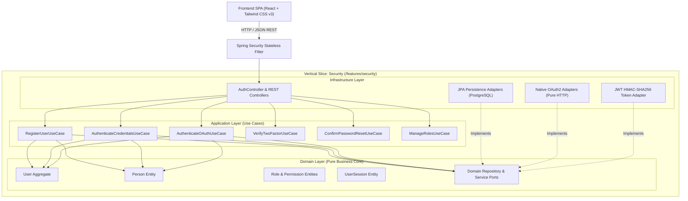

# 🏆 SportFlow - Plataforma de Gestión de Eventos Deportivos
## INFORME TÉCNICO Y EJECUTIVO - ENTREGA 1
**Módulo:** Seguridad y Control de Acceso (Identity & Access Management - IAM)  
**Documento Base:** Anexo 1: Módulo de Seguridad (`Anexo_1_Mdulo_Seguridad.docx`)  
**Fecha de Entrega:** 21 de Septiembre de 2026  
**Versión:** 1.0.0-PROD  
**Estado:** Entregado / Validado / 100% Funcional  

---

## 1. Resumen Ejecutivo del Proyecto

**SportFlow** es una solución integral diseñada para la organización, administración y seguimiento en tiempo real de torneos, campeonatos y eventos deportivos multideporte.

En esta **Primera Entrega**, se ha diseñado, construido y verificado con rigurosidad de nivel empresarial el **Módulo de Seguridad y Control de Acceso**. Este componente constituye el cimiento transversal de la plataforma, garantizando:
1. La protección integral de identidades y credenciales de deportistas, jueces, organizadores y administradores.
2. La gobernanza de privilegios mediante un esquema granular de **Control de Acceso Basado en Roles (RBAC)**.
3. La interoperabilidad moderna a través de autenticación federada con proveedores externos (**Google** y **GitHub**) sin dependencias comerciales propietarias.
4. La mitigación proactiva de vectores de ataque mediante **Autenticación de Dos Factores (2FA OTP)** y políticas estrictas de revocación de sesiones.

---

## 2. Marco Metodológico y Principios de Ingeniería Aplicados

El desarrollo se ejecutó bajo el **Contrato de Gobernanza Técnica Multi-Agente Ultra-Estricto**, implementando patrones avanzados de ingeniería de software:

### 2.1. Rebanadas Verticales (Vertical Slicing Architecture)
Se descartó la arquitectura tradicional por capas técnicas genéricas a nivel de raíz. Todo el código de seguridad se encuentra encapsulado en `src/features/security/`, dividiéndose estrictamente en:
- **`domain/`:** Entidades de negocio puras, lógica de invariantes y contratos de interfaces (puertos) sin dependencias de frameworks ni de bases de datos.
- **`application/`:** Casos de uso atómicos orquestadores que implementan las reglas de negocio de las 10 historias de usuario.
- **`infrastructure/`:** Adaptadores tecnológicos (Spring Data JPA, controladores REST, cliente HTTP nativo, adaptadores criptográficos BCrypt y JJWT).

### 2.2. Programación Orientada a Objetos (POO) Avanzada & DDD
- **Cero Modelos Anémicos:** Las entidades del dominio (`User`, `Role`, `UserSession`, etc.) encapsulan su propio estado y comportamiento. Métodos como `user.validarPassword()`, `user.activarSegundoFactor()` o `session.revocar()` protegen las invariantes de negocio directamente.
- **Separación Limpia Persona vs. Usuario:** Siguiendo las mejores prácticas de modelado de dominio, la entidad `Person` representa la identidad legal del individuo (nombres, documento, teléfono, foto), mientras que `User` modela el acceso lógico, credenciales y roles.

### 2.3. Principios S.I.D. (SOLID Enfocado)
- **S (Single Responsibility Principle):** Cada caso de uso en la capa de aplicación resuelve exclusivamente una historia de usuario o acción de negocio concreta.
- **I (Interface Segregation Principle):** Los puertos de dominio son específicos y concisos (`UserRepositoryPort`, `TokenGeneratorPort`, `OAuthClientPort`), impidiendo que los consumidores dependan de métodos que no necesitan.
- **D (Dependency Inversion Principle):** La lógica de negocio y aplicación depende exclusivamente de interfaces abstractas del dominio. La infraestructura implementa dichas interfaces en tiempo de ejecución mediante inyección de dependencias.

### 2.4. Regla de Oro Inviolable: Cero SDKs Comerciales
Quedó completamente prohibido el uso de SDKs empaquetados de terceros (como Firebase Auth, Supabase o SDKs propietarios de Google/GitHub).
- Toda comunicación hacia los servidores de **Google** (`https://www.googleapis.com/oauth2/v3/userinfo`) y **GitHub** (`https://api.github.com/user`, `https://github.com/login/oauth/access_token`) se construyó mediante un cliente HTTP nativo puro (`java.net.http.HttpClient`), inyectando cabeceras, serializando payloads JSON y procesando respuestas crudas paso a paso.

### 2.5. Gobernanza de Control de Versiones: Ramas `main` y `dev`
El repositorio en GitHub (`https://github.com/DavidSolorza/SportFlow-App.git`) se administra mediante una política estricta de dos ramas:
- **`main` (Release / Producción):** Rama base protegida e inmutable que contiene el código certificado y probado al 100% de la **Entrega 1**. Es el punto de referencia oficial para la evaluación académica y el despliegue a producción.
- **`dev` (Development / Integración):** Rama activa de desarrollo colaborativo donde se integran las nuevas características de los próximos anexos (torneos, partidos, estadísticas) antes de ser promovidas formalmente a `main`.

---

## 3. Cobertura de Requisitos: Anexo 1 (HU-SE-01 a HU-SE-10)

| ID Historia | Nombre de la Historia | Alcance Técnico Implementado | Estado |
| :--- | :--- | :--- | :---: |
| **HU-SE-01** | Gestionar usuarios | CRUD completo de usuarios, paginación, filtros por estado y rol, desactivación lógica, unicidad inmutable de email. | ✅ 100% |
| **HU-SE-02** | Gestionar perfiles | Actualización de datos personales (`Person`), teléfono, foto, sin alterar credenciales de acceso. | ✅ 100% |
| **HU-SE-03** | Gestionar roles | Alta, modificación y eliminación de roles. Validación estricta que impide eliminar un rol con usuarios asignados (`ROLE_HAS_ASSIGNED_USERS`). | ✅ 100% |
| **HU-SE-04** | Asignar roles a usuarios | Vinculación M:N entre usuarios y roles. Prevención de asignaciones duplicadas y retiro controlado de roles. | ✅ 100% |
| **HU-SE-05** | Gestionar permisos | Catálogo granular de permisos del sistema (`MODULO:ACCION`), consulta individual y matricial. | ✅ 100% |
| **HU-SE-06** | Asignar permisos a roles | Mapeo M:N de permisos por rol. Herencia transitiva de permisos para usuarios con múltiples roles. | ✅ 100% |
| **HU-SE-07** | Registro de usuarios | Autoregistro público con credenciales. Validación de complejidad de clave y encriptación robusta con BCrypt (costo 10). | ✅ 100% |
| **HU-SE-08** | Autenticación y gestión de sesión | Login local y federado con Google y GitHub. Auto-provisionamiento. Rechazo por conflicto con email local. Emisión de JWT Bearer (HMAC-SHA256) y revocación en base de datos. | ✅ 100% |
| **HU-SE-09** | Recuperar contraseña | Generación de token temporal de reseteo con expiración (15 min). Invalidación inmediata y masiva de todas las sesiones activas previas tras el cambio de clave. | ✅ 100% |
| **HU-SE-10** | Autenticación de Dos Factores (2FA) | Desafío temporal OTP de 6 dígitos para usuarios locales. La sesión no se activa ni emite JWT final hasta superar el desafío. | ✅ 100% |

---

## 4. Stack Tecnológico de la Solución

### Backend
- **Lenguaje:** Java 25 LTS (Release 21 target en bytecode)
- **Framework Core:** Spring Boot 3.4.0
- **Seguridad:** Spring Security 6.4.1 (Stateless Architecture)
- **Persistencia:** Spring Data JPA / Hibernate 6.6.2 (PostgreSQL 3NF / H2 PostgreSQL Mode)
- **Tokens Criptográficos:** JJWT 0.12.6 (JSON Web Tokens HMAC-SHA256)
- **Cliente HTTP Externo:** `java.net.http.HttpClient` nativo de Java Standard Library (Cero dependencias comerciales)
- **Validaciones:** Jakarta Bean Validation (Hibernate Validator)

### Frontend
- **Librería de Vista:** React 18
- **Empaquetador:** Vite 8.3
- **Estilos:** Tailwind CSS v3 (v3.4.17)
- **Iconografía:** Lucide React
- **Arquitectura de Red:** Cliente nativo `fetch` desacoplado de la UI mediante `apiClient.js` y `authApiService.js`

---

## 5. Índice de Documentos Entregados en esta Carpeta

Para la revisión exhaustiva de cada dimensión del sistema, se han estructurado los siguientes entregables dentro de este paquete de entrega:

1. [`1_ARQUITECTURA_Y_DISENO.md`](./1_ARQUITECTURA_Y_DISENO.md): Diagramas de componentes, diagramas de secuencia (Login 2FA y OAuth), y Registro de Decisiones de Arquitectura (ADRs).
2. [`2_MODELO_BASE_DE_DATOS_Y_DDL.md`](./2_MODELO_BASE_DE_DATOS_Y_DDL.md): Script DDL SQL ejecutable PostgreSQL 3NF (UUIDs, restricciones de integridad) y diccionario de datos detallado de 10 entidades.
3. [`3_ESPECIFICACION_API_REST.md`](./3_ESPECIFICACION_API_REST.md): Especificación exhaustiva de los contratos de entrada/salida JSON de todos los endpoints y matriz de códigos HTTP (`200`, `201`, `400`, `401`, `403`, `409`, `422`, `500`).
4. [`4_MATRIZ_TRAZABILIDAD_REQUISITOS.md`](./4_MATRIZ_TRAZABILIDAD_REQUISITOS.md): Matriz de cumplimiento 1:1 entre historias de usuario del Anexo 1 y artefactos de código fuente.
5. [`5_MANUAL_INSTALACION_Y_PRUEBAS.md`](./5_MANUAL_INSTALACION_Y_PRUEBAS.md): Guía de inicialización rápida, configuración de variables de entorno, comandos de arranque y evidencias de pruebas ejecutadas.
