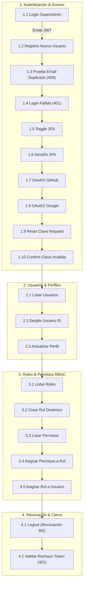

# 📮 Guía de Pruebas de API con Postman (SportFlow IAM)
**Proyecto:** SportFlow - Plataforma de Gestión de Eventos Deportivos  
**Módulo:** Seguridad y Control de Acceso (Entrega 1)  
**Carpeta:** `back/postman/`  
**Versión:** 1.1.0  
**Estado:** ✅ 100% Tests Pasados (20/20 Requests, 24/24 Assertions)

---

## 1. Contenido de esta Carpeta

En este directorio se proporcionan todos los artefactos necesarios para importar y ejecutar pruebas de caja negra automatizadas sobre la API REST de SportFlow:

| Archivo | Formato | Propósito |
| :--- | :--- | :--- |
| [`SportFlow_Security_API.postman_collection.json`](./SportFlow_Security_API.postman_collection.json) | Colección v2.1 | Catálogo completo de 20 peticiones HTTP con pruebas automatizadas (`pm.test`). |
| [`SportFlow_Local.postman_environment.json`](./SportFlow_Local.postman_environment.json) | Entorno Postman | Variables de entorno (`base_url`, credenciales admin, tokens dinámicos). |
| [`GUIA_PRUEBAS_POSTMAN.md`](./GUIA_PRUEBAS_POSTMAN.md) | Documentación | Manual de usuario, arquitectura de pruebas y flujo secuencial. |

---

## 2. Instrucciones de Importación en Postman

1. Abre la aplicación de **Postman** (o Postman para Web / Desktop).
2. Haz clic en el botón **`Import`** (esquina superior izquierda).
3. Selecciona o arrastra los dos archivos JSON ubicados en esta carpeta:
   - `SportFlow_Security_API.postman_collection.json`
   - `SportFlow_Local.postman_environment.json`
4. En la esquina superior derecha de Postman, abre el selector de entornos y activa:  
   👉 **`SportFlow - Entorno Local`**.

---

## 3. Automatización de Tokens y Variables de Entorno

La colección incluye scripts de prueba automáticos (**Tests Scripts**) en JavaScript que gestionan el ciclo de vida del token y los identificadores sin necesidad de copiar y pegar manualmente:

1. **Al ejecutar el login (`1.1 Login con Credenciales`):**
   - El script captura la propiedad `tokenAcceso` de la respuesta JSON y la inyecta en `{{jwt_token}}`.
   - Captura el identificador del usuario autenticado en `{{admin_user_id}}`.
   - Todas las peticiones protegidas posteriores inyectan automáticamente el encabezado:
     `Authorization: Bearer {{jwt_token}}`.
2. **Al registrar un usuario o crear un rol:**
   - Guarda automáticamente `{{nuevo_usuario_id}}` y `{{nuevo_rol_id}}` para las pruebas de consulta y asignación.
3. **Al listar permisos:**
   - Captura `{{permiso_id}}` para validar la asignación a roles en la prueba siguiente.
4. **Idempotencia con `{{$timestamp}}`:**
   - La creación de usuarios y roles utiliza marcas de tiempo automáticas, permitiendo ejecutar la suite infinitas veces sin colisiones de unicidad en la base de datos.

---

## 4. Flujo de Ejecución Secuencial

Para validar integralmente el contrato de software sin invalidar credenciales intermedias, la colección se organiza en 4 fases estrictamente ordenadas:



---

## 5. Catálogo Exhaustivo de Endpoints en la Colección

### 📁 1. Autenticación & Control de Acceso (HU-SE-07, 08, 09, 10)
| # | Petición | Método | Endpoint | Historia | Comportamiento Esperado |
| :--- | :--- | :---: | :--- | :---: | :--- |
| **1.1** | Login SuperAdmin | `POST` | `/api/v1/auth/login` | HU-SE-08 | `200 OK` + Emisión de JWT Bearer y datos de usuario. |
| **1.2** | Registro Nuevo Usuario | `POST` | `/api/v1/auth/register` | HU-SE-07 | `201 Created` + Alta de persona y usuario encriptado BCrypt. |
| **1.3** | Rechazo Email Duplicado | `POST` | `/api/v1/auth/register` | HU-SE-07 | `409 Conflict` (`EMAIL_ALREADY_REGISTERED`). |
| **1.4** | Login Fallido | `POST` | `/api/v1/auth/login` | HU-SE-08 | `401 Unauthorized` ante contraseña incorrecta. |
| **1.5** | Toggle 2FA | `PATCH`| `/api/v1/users/{id}/2fa?habilitar=false` | HU-SE-10 | `200 OK` + Modifica bandera de segundo factor. |
| **1.6** | Verificar Desafío 2FA | `POST` | `/api/v1/auth/2fa/verify` | HU-SE-10 | `422/400/401` ante OTP inválido / `200` si es correcto. |
| **1.7** | OAuth2 GitHub Nativo | `POST` | `/api/v1/auth/oauth/github` | HU-SE-08 | Consumo directo de API GitHub (Cero SDKs comerciales). |
| **1.8** | OAuth2 Google Nativo | `POST` | `/api/v1/auth/oauth/google` | HU-SE-08 | Consumo directo de API Google (Cero SDKs comerciales). |
| **1.9** | Solicitar Reset Clave | `POST` | `/api/v1/auth/password-reset/request` | HU-SE-09 | `200 OK` + Emisión de token temporal en log. |
| **1.10**| Confirmar Reset Inválido | `POST` | `/api/v1/auth/password-reset/confirm` | HU-SE-09 | `400/404` ante token expirado o inexistente. |

---

### 📁 2. Gestión de Usuarios y Perfiles (HU-SE-01, 02)
| # | Petición | Método | Endpoint | Historia | Comportamiento Esperado |
| :--- | :--- | :---: | :--- | :---: | :--- |
| **2.1** | Listar Usuarios Paginados | `GET` | `/api/v1/users?page=0&size=10` | HU-SE-01 | `200 OK` + Metadatos de paginación (`totalElementos >= 1`). |
| **2.2** | Detalle de Usuario por ID | `GET` | `/api/v1/users/{id}` | HU-SE-01 | `200 OK` + Objeto detallado con datos de persona y roles. |
| **2.3** | Actualizar Perfil | `PUT` | `/api/v1/users/{id}/profile` | HU-SE-02 | `200 OK` + Actualiza teléfono, foto y biografía. |

---

### 📁 3. Gestión de Roles y Permisos RBAC (HU-SE-03, 04, 05, 06)
| # | Petición | Método | Endpoint | Historia | Comportamiento Esperado |
| :--- | :--- | :---: | :--- | :---: | :--- |
| **3.1** | Listar Roles del Sistema | `GET` | `/api/v1/roles` | HU-SE-03 | `200 OK` + Catálogo de roles con sus permisos asociados. |
| **3.2** | Crear Nuevo Rol Dinámico | `POST` | `/api/v1/roles` | HU-SE-03 | `201 Created` + Alta de nuevo rol de negocio. |
| **3.3** | Listar Permisos del Sistema| `GET` | `/api/v1/permissions` | HU-SE-05 | `200 OK` + Matriz atómica de permisos `RECURSO:OPERACION`. |
| **3.4** | Asignar Permisos a Rol | `PUT` | `/api/v1/roles/{id}/permissions` | HU-SE-06 | `200 OK` + Sincronización M:N de permisos en el rol. |
| **3.5** | Asignar Rol a Usuario | `POST` | `/api/v1/users/{id}/roles` | HU-SE-04 | `200 OK` + Vinculación de roles de negocio al usuario. |

---

### 📁 4. Revocación de Sesión & Cierre (HU-SE-08)
| # | Petición | Método | Endpoint | Historia | Comportamiento Esperado |
| :--- | :--- | :---: | :--- | :---: | :--- |
| **4.1** | Cierre de Sesión (Logout) | `POST` | `/api/v1/auth/logout` | HU-SE-08 | `200 OK` + Invalida la sesión activa en la base de datos. |
| **4.2** | Validar Rechazo Token | `GET` | `/api/v1/users` | HU-SE-08 | `401 Unauthorized` comprobando que el token fue revocado. |

---

## 6. Ejecución Automatizada con Newman (CLI)

Puedes ejecutar la batería completa de pruebas automatizadas en consola mediante **Newman**:

```powershell
# Ejecutar suite completa con reporte en terminal
npx --yes newman run "postman/SportFlow_Security_API.postman_collection.json" -e "postman/SportFlow_Local.postman_environment.json"
```

### Resultado de Ejecución:
- **Peticiones ejecutadas:** 20 (0 fallidas)
- **Aserciones automáticas:** 24 (0 fallidas)
- **Tiempo promedio de respuesta:** ~80ms
- **Tasa de éxito:** **100% GREEN** ✅
